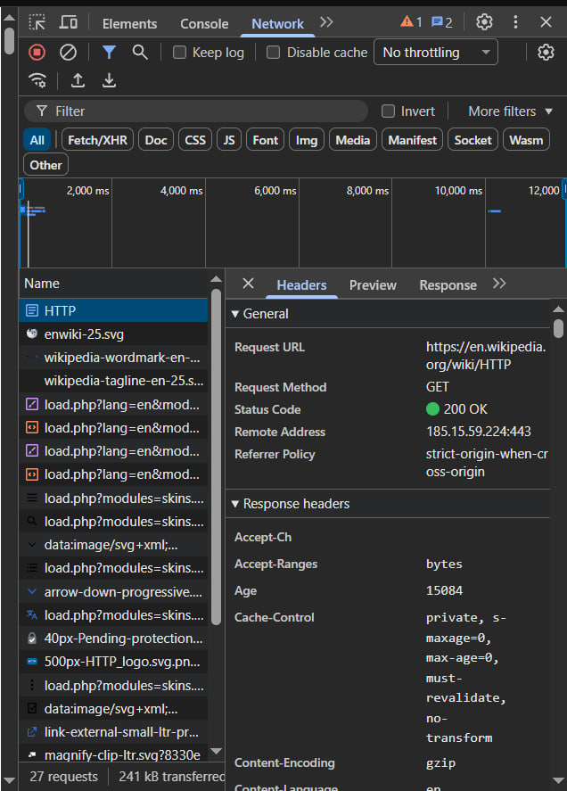
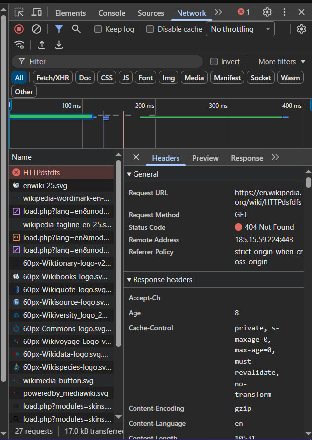
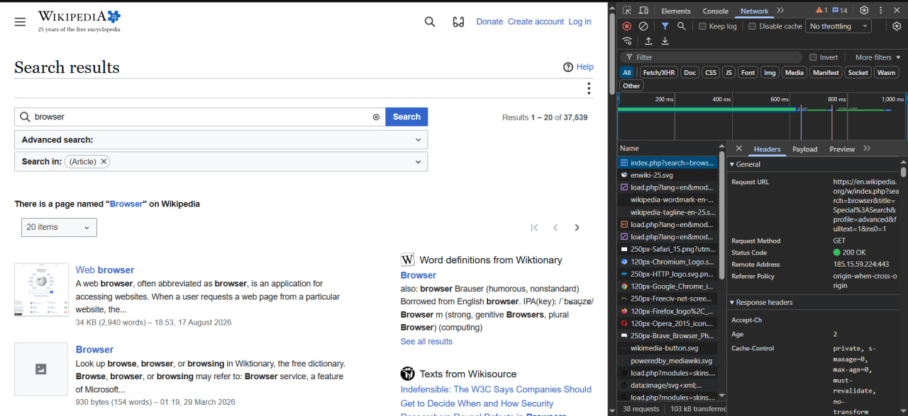
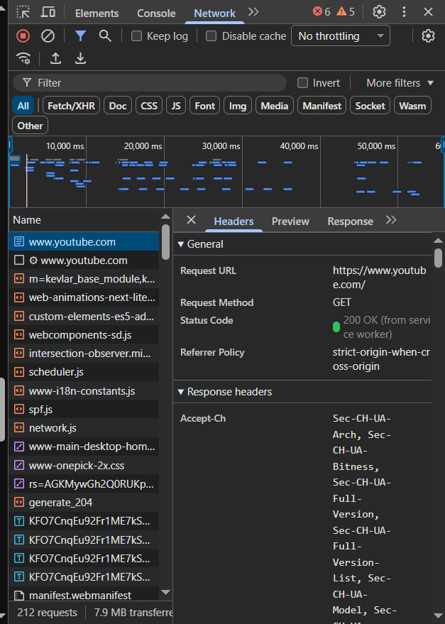

# Лабораторная работа №1. HTTP

## Цель работы

Понять, как браузер общается с сервером через HTTP

Основные цели:

- посмотреть реальные HTTP-запросы через DevTools
- понять разницу между `GET`, `POST`, `PUT`, `DELETE`
- разобрать заголовки запроса и ответа
- посмотреть, как используются query parameters
- научиться самостоятельно составлять простые HTTP-запросы
- разобраться, что означают основные HTTP-коды состояния

---


# Задание 1. Анализ HTTP-запросов. Часть 1

Страница для анализа:

`https://en.wikipedia.org/wiki/HTTP`

Открываем `DevTools -> Network` и обноввляем страницу

> screenshots/1.jpg

## 1.1 Основной запрос страницы Wikipedia

### URL

```text
https://en.wikipedia.org/wiki/HTTP
```

### Метод запроса

```text
GET
```

Используется именно `GET`, потому что браузеру нужно получить уже существующий ресурс с сервера. Никакие данные на сервере при этом изменять не требуется.

### Статус ответа

```text
200 OK
```

`200 OK` означает, что сервер успешно обработал запрос и вернул нужный ресурс

### Заголовки запроса

```text
Host: en.wikipedia.org
User-Agent: Mozilla/5.0 ...
Accept: text/html,...
Accept-Language: en
Accept-Encoding: gzip, deflate, br
Connection: keep-alive
```

Что они означают:

- `Host` - адрес сервера, к которому выполняется запрос
- `User-Agent` - информация о браузере, операционной системе и клиенте
- `Accept` - форматы данных, которые клиент готов принять
- `Accept-Language` - предпочитаемый язык
- `Accept-Encoding` - способы сжатия ответа, которые поддерживает браузер
- `Connection` - настройки соединения между клиентом и сервером

### Заголовки ответа


```text
Content-Type: text/html; charset=UTF-8
Content-Encoding: gzip
Cache-Control: ...
Server: ...
Strict-Transport-Security: ...
```

Назначение некоторых заголовков:

- `Content-Type` - показывает тип возвращаемых данных
- `Content-Encoding` - показывает способ сжатия ответа
- `Cache-Control` - управляет кешированием
- `Server` - содержит информацию о серверной части
- `Strict-Transport-Security` - заставляет браузер использовать защищенное HTTPS-соединение

### Тело запроса и ответа

У обычного `GET`-запроса тело чаще всего отсутствует

В теле ответа находится содержимое страницы, которое затем обрабатывает браузер

### Какие еще запросы отправляются

При загрузке страницы браузер получает не только HTML

Также загружаются:

- CSS-файлы
- JavaScript
- изображения
- иконки
- шрифты
- дополнительные данные API
- служебные ресурсы

Это происходит потому, что одна HTML-страница обычно зависит от большого количества внешних ресурсов

---

## 1.2 Запрос к несуществующей странице

```text
https://en.wikipedia.org/wiki/HTTPdsfdfs
```

Cтатус:

```text
404 Not Found
```

`404 Not Found` означает, что сервер доступен, но запрошенный ресурс не найден

То есть проблема не в соединении с Wikipedia, а именно в том, что такой страницы нет

>> screenshots/1.jpg

---

# Задание 2. Анализ HTTP-запросов. Часть 2

Страница: 

`https://en.wikipedia.org/wiki/Special:Search`

В строке поиска было введено слово:

```text
browser
```

После отправки формы в `Network` появляется запрос поиска

> 

## URL запроса

```text
https://en.wikipedia.org/w/index.php?search=browser&title=Special%3ASearch&go=Go
```

## Метод

```text
GET
```

Для поиска используется `GET`, потому что сервер только возвращает результаты и не должен изменять данные. Еще один плюс в том, что параметры поиска остаются прямо в URL и такую ссылку можно сохранить или отправить другому человеку.

## Query Parameters

В URL передаются параметры:

```text
search=browser
title=Special:Search
profile=advanced
fulltext=1
ns0=1
```

В запросе передаются следующие параметры:

- `search=browser` - слово, которое пользователь ввел в строку поиска
- `title=Special:Search` - указывает, что запрос обрабатывается специальной страницей поиска Wikipedia
- `profile=advanced` - означает, что используется расширенный режим поиска
- `fulltext=1` - включает поиск по полному тексту страниц
- `ns0=1` - ограничивает поиск основным пространством статей Wikipedia

Параметры передаются прямо в URL после символа `?`

Несколько параметров разделяются символом `&`


---

# Задание 3. Анализ HTTP-запросов. Часть 3

Для анализа выбираем:

`https://youtube.com`

> 

## Основной запрос

### URL

```text

https://www.youtube.com/
```

### Метод

```text
GET
```

### Статус

```text
200 OK
```

Это означает, что главная страница Yotube была успешно получена

### Полезные заголовки ответа

- `Content-Type` - тип содержимого ответа
- `Cache-Control` - правила кеширования
- `Set-Cookie` - установка cookie
- `Content-Security-Policy` - правила безопасности страницы
- `Strict-Transport-Security` - принудительное использование HTTPS


### Тело ответа

В теле ответа находится HTML-код страницы YouTube

В нем содержится структура страницы и данные, необходимые для ее первоначальной загрузки. После этого браузер отдельно загружает JavaScript, стили, изображения, превью видео и другие ресурсы
---

# Задание 4. Составление HTTP-запросов

## 4.1 GET-запрос

Пример запроса к серверу:

```http
GET / HTTP/1.1
Host: sandbox.usm.com
User-Agent: Anastasia Andreeva
Accept: text/html
```

### Что такое User-Agent

`User-Agent` - это HTTP-заголовок с информацией о клиенте, который отправляет запрос

Браузер обычно передает в нем свое название, версию, операционную систему и другие данные. Сервер может использовать эту информацию для совместимости, аналитики или определения автоматических клиентов.

---

## 4.2 POST-запрос

Пример:

```http
POST /cars HTTP/1.1
Host: sandbox.usm.com
Content-Type: application/x-www-form-urlencoded

make=Toyota&model=Corolla&year=2020
```

`POST` используется, когда клиент отправляет данные на сервер, например для создания новой записи

### Другие HTTP-методы

- `GET` - получить данные
- `POST` - отправить данные и обычно создать новый ресурс
- `PUT` - полностью заменить существующий ресурс
- `PATCH` - изменить только часть ресурса
- `DELETE` - удалить ресурс
- `HEAD` - получить только заголовки ответа без тела
- `OPTIONS` - узнать доступные методы и параметры взаимодействия с сервером

---

## 4.3 PUT-запрос

Пример запроса:

```http
PUT /cars/1 HTTP/1.1
Host: sandbox.usm.com
User-Agent: Anastasia Andreeva
Content-Type: application/json

{
  "make": "Toyota",
  "model": "Corolla",
  "year": 2021
}
```

Такой запрос сообщает серверу, что ресурс `/cars/1` должен быть обновлен переданными данными

### Разница между PUT и PATCH

`PUT` обычно используется для полной замены ресурса

Например, если объект автомобиля состоит из `make`, `model` и `year`, то при `PUT` сервер ожидает полное новое состояние объекта

`PATCH` используется для частичного изменения

Например, если нужно поменять только год:

```http
PATCH /cars/1 HTTP/1.1
Host: sandbox.usm.com
Content-Type: application/json

{
  "year": 2022
}
```

В этом случае марка и модель автомобиля не должны измениться

---

## 4.4 Пример ответа сервера

Исходный запрос:

```http
POST /cars HTTP/1.1
Host: sandbox.com
Content-Type: application/json
User-Agent: John Doe

model=Corolla&make=Toyota&year=2020
```

Здесь есть небольшая проблема: в заголовке указан `application/json`, но тело записано не в JSON-формате

Поэтому сервер вполне может вернуть `400 Bad Request`

Если представить, что сервер все же принял данные и успешно создал автомобиль, ответ может выглядеть так:

```http
HTTP/1.1 201 Created
Content-Type: application/json
Location: /cars/42

{
  "id": 42,
  "make": "Toyota",
  "model": "Corolla",
  "year": 2020,
  "status": "created"
}
```

## Когда могут возвращаться разные HTTP-коды

### 200 OK

Сервер успешно обработал запрос и вернул результат

Например, такой код можно получить после успешного обновления или когда API специально возвращает `200` после создания записи

### 201 Created

Новая запись автомобиля была успешно создана

Для успешного `POST`, создающего новый ресурс, это один из самых подходящих статусов

### 400 Bad Request

Запрос содержит ошибку

В данном примере это возможно из-за несоответствия между:

```text
Content-Type: application/json
```

и фактическим телом:

```text
model=Corolla&make=Toyota&year=2020
```

Если используется JSON, тело должно выглядеть примерно так:

```json
{
  "model": "Corolla",
  "make": "Toyota",
  "year": 2020
}
```

### 401 Unauthorized

Сервер требует авторизацию, но клиент не передал правильный токен или другие данные для входа

### 403 Forbidden

Сервер понял запрос и пользователь может быть авторизован, но у него нет прав на выполнение операции

Например, обычному пользователю запрещено добавлять автомобили

### 404 Not Found

Сервер не нашел нужный маршрут или ресурс

Например, endpoint `/cars` отсутствует в приложении или указан неправильный адрес

### 500 Internal Server Error

Ошибка произошла внутри сервера

Например, приложение не смогло подключиться к базе данных или в серверном коде возникло исключение

---

# Итог

Во время лабораторной работы я посмотрела, какие запросы браузер реально отправляет при открытии страницы и при поиске. Также я разобралась с основными HTTP-методами, заголовками, параметрами URL и кодами состояния.

Главное, что я поняла - HTTP-запрос состоит не только из URL. В нем также важны метод, заголовки, параметры и иногда тело, а сервер в ответ возвращает статус, заголовки и данные.
