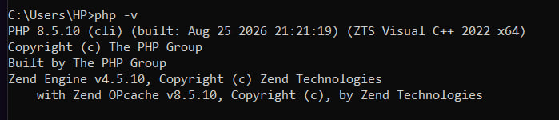
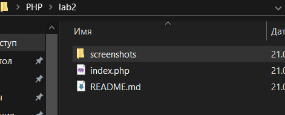
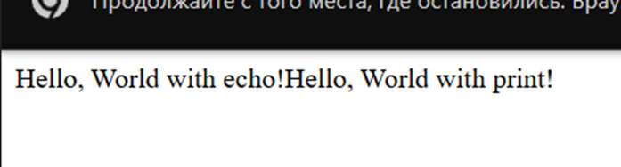
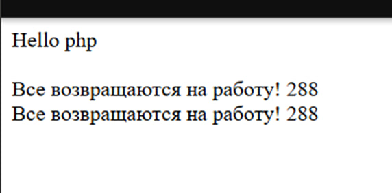

# Лабораторная работа №2
## Установка и первая программа на PHP

### Цель работы

Установить и настроить PHP, проверить работу интерпретатора, создать первую PHP программу и изучить вывод данных с помощью `echo` и `print`

## Шаг 1 Установка PHP

PHP был скачан с официального сайта и распакован в папку

```text
C:\Program Files\php
```

Путь к PHP был добавлен в переменную среды `Path`

Для проверки установки использована команда

```powershell
php -v
```




## Шаг 2 Создание проекта

Для лабораторной работы создана папка

```text
C:\Users\HP\Desktop\PHP\lab2
```

В папке создан файл

```text
index.php
```

### Скриншот структуры проекта



## Шаг 3 Первая PHP программа

В файл `index.php` добавлен код

```php
<?php

echo "Привет, мир!";
```

### Запуск программы

Программа была запущена с помощью встроенного веб сервера PHP

```powershell
php -S localhost:8000
```

Если PHP запускается по полному пути

```powershell
& "C:\Program Files\php\php.exe" -S localhost:8000
```

После запуска сервер доступен по адресу

```text
http://localhost:8000
```


### Скриншот результата первой программы


## Шаг 4 Вывод данных в PHP

Для вывода текста были использованы `echo` и `print`

```php
<?php

echo "Hello, World with echo!<br>";
print "Hello, World with print!<br>";
```

### Скриншот результата



## Шаг 5 Работа с переменными и выводом

Созданы две переменные

```php
$days = 288;
$message = "Все возвращаются на работу!";
```

Для объединения строк использована конкатенация с оператором `.`

Также использована интерполяция переменных в строках с двойными кавычками

Для перехода на новую строку в браузере используется тег `<br>`

Полный код

```php
<?php

$days = 288;
$message = "Все возвращаются на работу!";

echo "Количество дней: " . $days . "<br>";
echo "Сообщение: " . $message . "<br>";

echo "Количество дней: $days<br>";
echo "Сообщение: $message<br>";
```

### Скриншот результата



## Итоговый вариант index.php

```php
<?php

echo "Привет, мир!<br><br>";

echo "Hello, World with echo!<br>";
print "Hello, World with print!<br><br>";

$days = 288;
$message = "Все возвращаются на работу!";

echo "Количество дней: " . $days . "<br>";
echo "Сообщение: " . $message . "<br><br>";

echo "Количество дней: $days<br>";
echo "Сообщение: $message<br>";
```

## Контрольные вопросы

### 1 Какие способы установки PHP существуют

PHP можно установить отдельно, скачав интерпретатор с официального сайта и добавив путь к нему в `Path`

Также можно использовать готовую сборку, например XAMPP или OpenServer, которая включает PHP и веб сервер

На macOS и Linux PHP также можно установить через системный менеджер пакетов

### 2 Как проверить, что PHP установлен и работает

В терминале нужно выполнить команду

```powershell
php -v
```

Если PHP установлен правильно, терминал выведет его версию

Работу PHP через встроенный веб сервер можно проверить командой

```powershell
php -S localhost:8000
```

После этого нужно открыть в браузере

```text
http://localhost:8000
```

Если страница из `index.php` отображается, PHP работает корректно

### 3 Чем отличается echo от print

`echo` и `print` используются для вывода данных

`echo` может принимать несколько значений и ничего не возвращает

`print` принимает только одно значение и возвращает число `1`

На практике чаще используется `echo`
